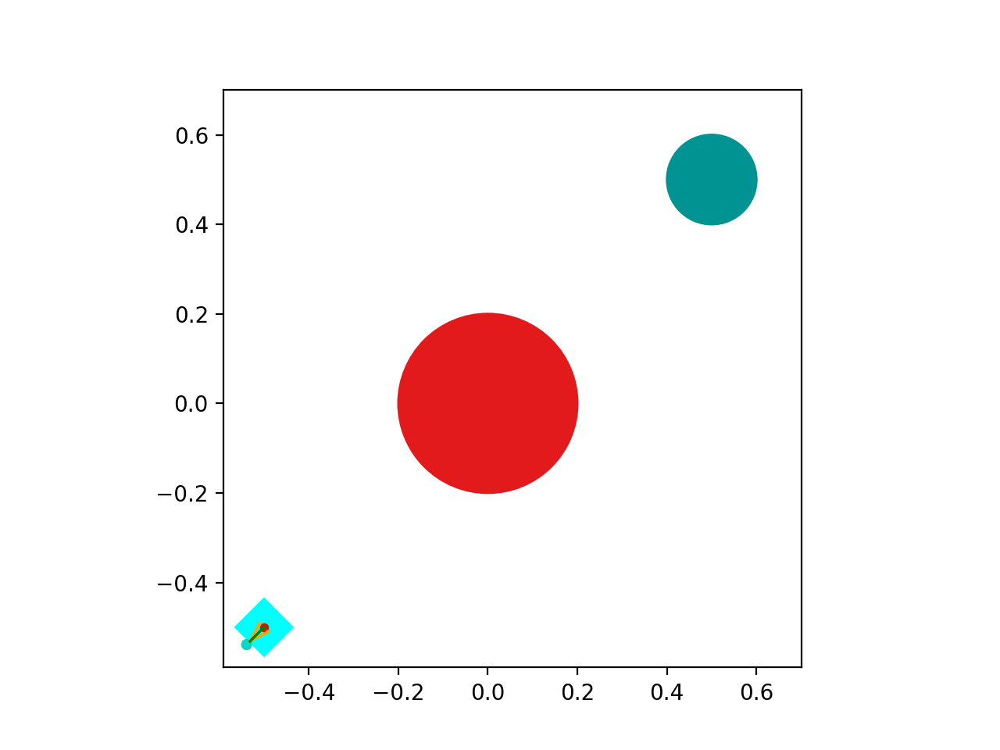

# slider-benchmarks
A number of manipulation algorithms for the Pusher-Slider benchmark system 
[\[1\]](https://arxiv.org/abs/1611.08268) 
[\[2\]](https://journals.sagepub.com/doi/10.1177/0278364919872532) 
from robot manipulation. 

|  |
|:-----------------------------:|
| Python Simulation             |

The system is implemented in Python and Julia.

## Installation

I am still considering whether to make this an official 
Python or Julia package (I've never created either of those before!)
if you are interested in making them an official package, then 
create an issue!
